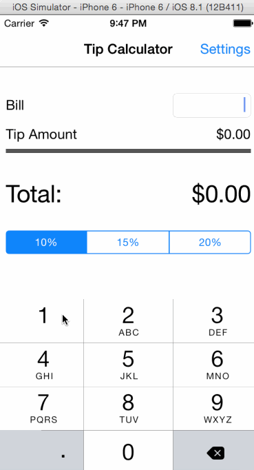

# Tip Calculator with Customizable Tip Values

Time spent: 8-10 hours spent in total :(

Completed user stories:

* [x] Required: Calculates tip with three preset tip percentages.
* [x] Required: Settings page for user to customize tip values.
* [-] Optional: Play with colors, layout, etc.

Notes:

* Holy crap Objective-c Syntax! FML. :(
* Could have worked on making sure the picker restricts values in increasing order

Walkthrough of all user stories:

GIF created with [LiceCap](http://www.cockos.com/licecap/).
